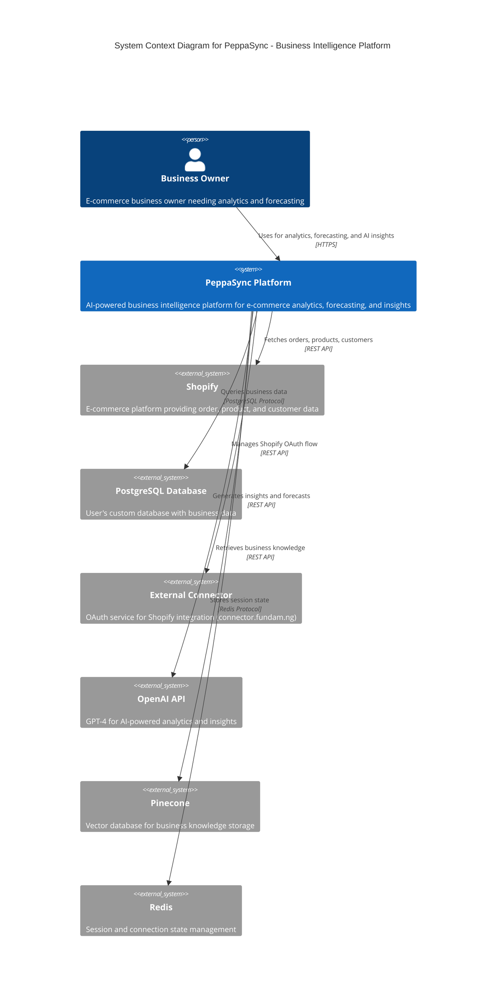
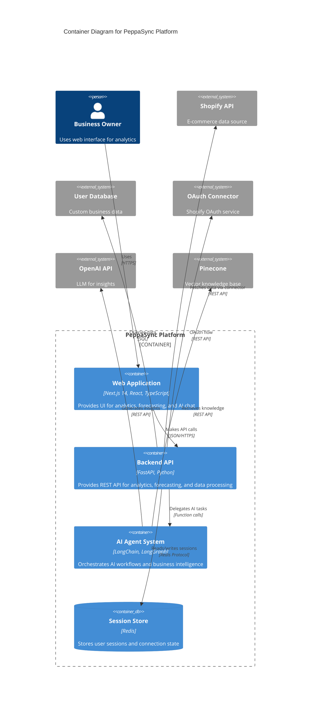
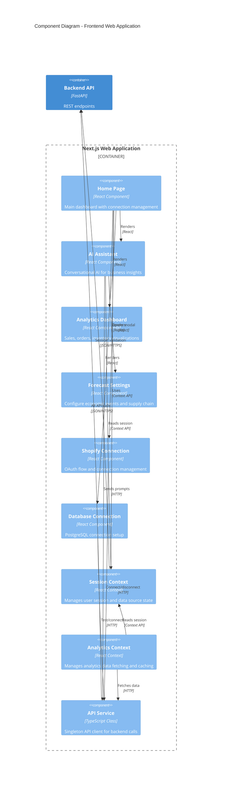
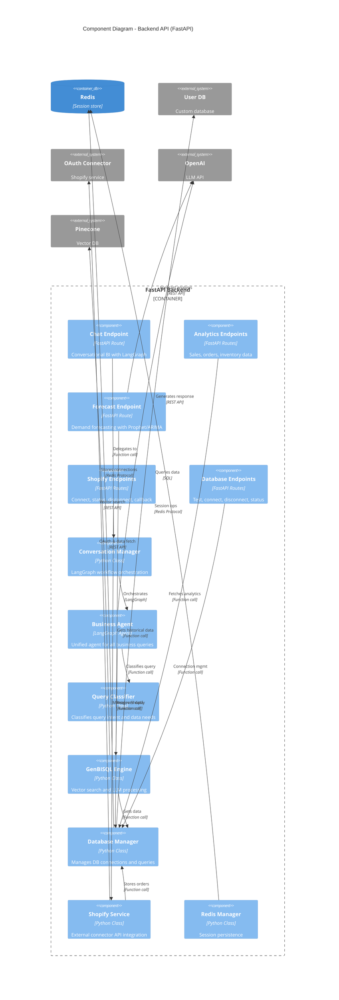
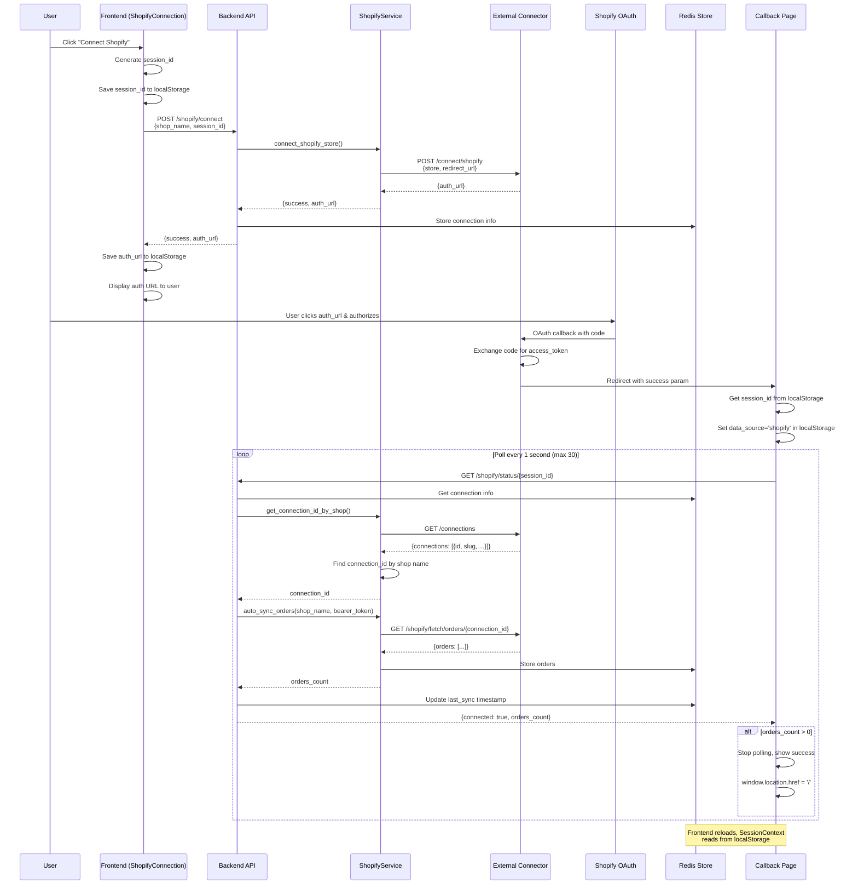
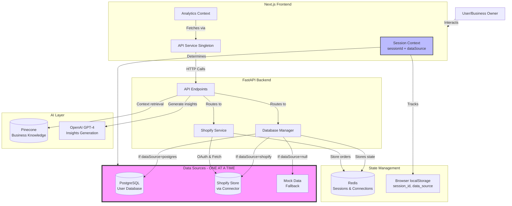
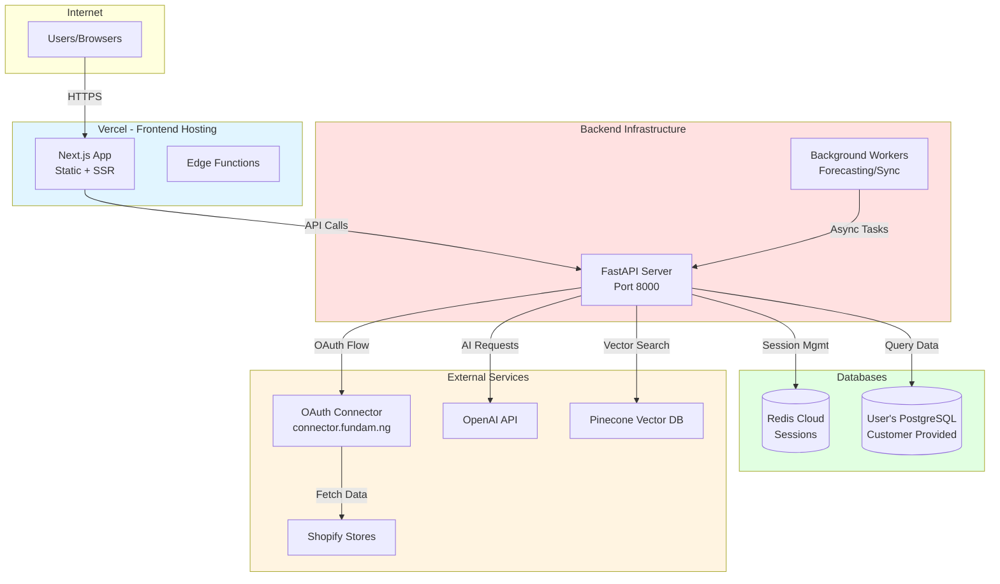

# PeppaSync - C4 Architecture Model

## Level 1: System Context Diagram

---

## Level 2: Container Diagram

---

## Level 3: Component Diagram - Frontend (Next.js App)

---

## Level 3: Component Diagram - Backend API

---

## Level 4: Code Diagram - Shopify Integration Flow

---

## Data Flow Diagram - Single Data Source Architecture

---

## Deployment Architecture

---

## Technology Stack

### Frontend
- **Framework**: Next.js 14 (App Router)
- **Language**: TypeScript
- **UI Library**: React 18
- **Styling**: Tailwind CSS
- **State Management**: React Context API
- **Charts**: Recharts
- **Icons**: Lucide React

### Backend
- **Framework**: FastAPI
- **Language**: Python 3.9+
- **AI/ML**: LangChain, LangGraph
- **Forecasting**: Prophet, ARIMA (statsmodels)
- **LLM**: OpenAI GPT-4o-mini
- **Vector DB**: Pinecone
- **Session Store**: Redis

### Data Sources
- **PostgreSQL**: User's custom database
- **Shopify**: Via external OAuth connector
- **Mock Data**: Fallback for demos

### Infrastructure
- **Frontend Hosting**: Vercel
- **Backend Hosting**: Cloud VM / Docker
- **Session Storage**: Redis Cloud
- **Vector Storage**: Pinecone Cloud

---

## Key Design Patterns

1. **Single Data Source Architecture**: Only ONE data source active per session (PostgreSQL OR Shopify OR Mock)

2. **Session-Based Isolation**: Each user has isolated session with dedicated data source connection

3. **Frontend-Tracked State**: Connection state tracked in localStorage + React Context, not backend polling

4. **OAuth Delegation**: Shopify OAuth handled by external connector service, not direct integration

5. **AI Agent Pattern**: LangGraph orchestrates unified business agent for all query types

6. **Vector-Augmented Generation**: Business knowledge from Pinecone combined with user data

7. **Automatic Fallback**: Mock data used when no data source connected

8. **Redis-First Session**: All sessions and connections persisted in Redis with 24hr TTL

---

## Security Considerations

1. **No Credential Storage**: Database credentials never stored, only connection strings in Redis
2. **Session Isolation**: Each session completely isolated, no cross-contamination
3. **OAuth Best Practices**: External connector handles token exchange, not direct app
4. **API Key Protection**: OpenAI and Pinecone keys server-side only
5. **HTTPS Only**: All external communication encrypted
6. **Input Validation**: All user inputs validated before DB queries
7. **SQL Injection Protection**: Parameterized queries only, no string concatenation

---

## Scalability Considerations

1. **Stateless Backend**: API servers can scale horizontally
2. **Redis Clustering**: Session store can be clustered for high availability
3. **Pinecone Sharding**: Vector DB scales with data volume
4. **Async Processing**: Background workers for heavy forecasting tasks
5. **CDN Distribution**: Frontend static assets served via Vercel CDN
6. **Connection Pooling**: Database connections pooled and reused
7. **Rate Limiting**: OpenAI API calls throttled to prevent quota exhaustion

