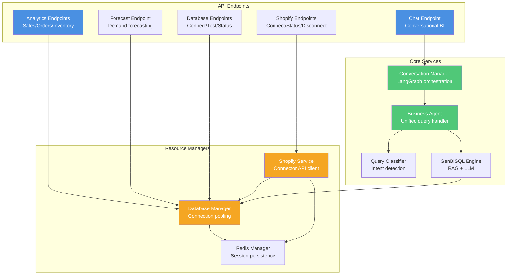

# PeppaSync - System Architecture Documentation

> Complete C4 Model and UML diagrams for the PeppaSync Business Intelligence Platform

---

## Level 1: System Context

**Overview**: How PeppaSync fits into the user's world


---

## Level 2: Container Diagram

**Overview**: Major components and their responsibilities


---

## Level 3: Frontend Components

**Overview**: Next.js application structure


---

## Level 3: Backend Components

**Overview**: FastAPI application structure



---

## Shopify OAuth Integration Flow

**Detailed sequence of Shopify connection process**


---

## Data Source Architecture

**Single data source per session**


---

## AI Agent Workflow

**LangGraph conversation flow**


---

## Deployment Architecture


---

## Technology Stack

### Frontend Stack
```
┌─────────────────────────────────┐
│   Next.js 14 (App Router)       │
│   React 18 + TypeScript          │
│   Tailwind CSS                   │
│   Context API (State)            │
│   Recharts (Visualization)       │
│   Lucide Icons                   │
└─────────────────────────────────┘
```

### Backend Stack
```
┌─────────────────────────────────┐
│   FastAPI (Python 3.9+)          │
│   LangChain + LangGraph          │
│   Prophet + ARIMA (Forecasting)  │
│   OpenAI GPT-4o-mini             │
│   Pinecone (Vector DB)           │
│   Redis (Sessions)               │
│   PostgreSQL (User data)         │
└─────────────────────────────────┘
```

---

## Key Architectural Decisions

### 1. Single Data Source Architecture
**Decision**: Only ONE data source active per session (PostgreSQL OR Shopify OR Mock)

**Rationale**:
- Prevents data confusion and mixing
- Clear source of truth for analytics
- Simpler state management
- Easier to debug and maintain

### 2. Frontend-Tracked Connection State
**Decision**: Store connection state in localStorage + React Context, not backend polling

**Rationale**:
- Reduces backend load
- Faster UI responsiveness
- Works offline/during backend restart
- Survives page refreshes

### 3. External OAuth Connector
**Decision**: Use external connector service instead of direct Shopify OAuth

**Rationale**:
- Outsources OAuth complexity
- No need to manage Shopify app credentials
- Connector handles token refresh
- Reduces security surface area

### 4. Unified AI Agent Pattern
**Decision**: Single LangGraph agent handles all query types

**Rationale**:
- Eliminates endpoint proliferation
- Natural language interface
- Context-aware responses
- Easier to extend with new capabilities

### 5. Redis-First Session Management
**Decision**: All sessions and connections in Redis with 24hr TTL

**Rationale**:
- Fast session lookup
- Automatic cleanup via TTL
- Horizontal scalability
- No database overhead for temporary state

---

## Security Architecture


---

## Scalability Patterns

### Horizontal Scaling
- Stateless FastAPI servers
- Redis clustering for sessions
- Pinecone auto-scaling
- Vercel CDN for frontend

### Performance Optimization
- Connection pooling (PostgreSQL)
- Response caching (Analytics)
- Background workers (Forecasting)
- Lazy loading (Frontend)

### Resource Management
- Rate limiting (OpenAI)
- Query timeout (30s max)
- Session TTL (24hr auto-cleanup)
- Vector index optimization

---

## Data Flow Example: "What were my sales last month?"


---

## Error Handling Strategy


---

## File Structure

```
peppasync-main/
├── peppasync-ai/                    # Frontend (Next.js)
│   ├── app/
│   │   ├── components/              # React components
│   │   │   ├── AIAssistant.tsx      # Conversational AI
│   │   │   ├── ShopifyConnection.tsx # Shopify OAuth
│   │   │   ├── DatabaseConnection.tsx
│   │   │   └── ForecastSettingsModal.tsx
│   │   ├── contexts/                # State management
│   │   │   ├── SessionContext.tsx   # Session + dataSource
│   │   │   └── AnalyticsContext.tsx # Data caching
│   │   ├── lib/
│   │   │   └── api.ts               # API client singleton
│   │   ├── shopify/callback/
│   │   │   └── page.tsx             # OAuth callback
│   │   └── page.tsx                 # Home dashboard
│   └── package.json
│
├── peppasync-langchain/             # Backend (FastAPI)
│   ├── app.py                       # Main FastAPI app
│   ├── lib/
│   │   ├── config.py                # Database manager
│   │   ├── shopify_service.py       # Shopify integration
│   │   ├── conversation_manager.py  # LangGraph orchestration
│   │   ├── query_classifier.py      # Query intent detection
│   │   ├── peppagenbi.py            # GenBISQL + RAG
│   │   └── redis_session.py         # Redis manager
│   └── requirements.txt
│
└── C4-ARCHITECTURE.md               # This file
```

---

## Next Steps & Roadmap

### Phase 1: Stability (Current)
- Single data source architecture
- Shopify OAuth integration
- Demand forecasting
- AI conversational interface

### Phase 2: Enhancement
-  Multi-warehouse support
-  Real-time data sync
-  Custom alert system
-  Export to Excel/PDF

### Phase 3: Scale
- ⏳ Multi-tenant architecture
- ⏳ Team collaboration
- ⏳ API for third-party integrations
- ⏳ Advanced ML models

---

**Documentation Version**: 1.0
**Last Updated**: 2025-01-19
**System**: PeppaSync Business Intelligence Platform
