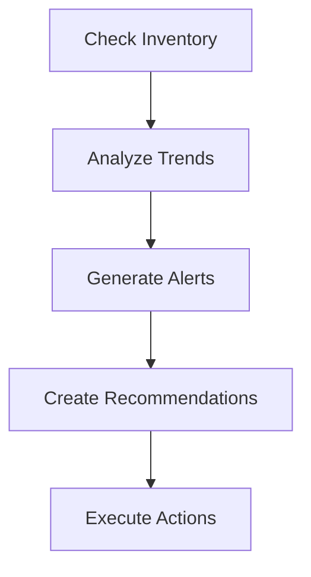
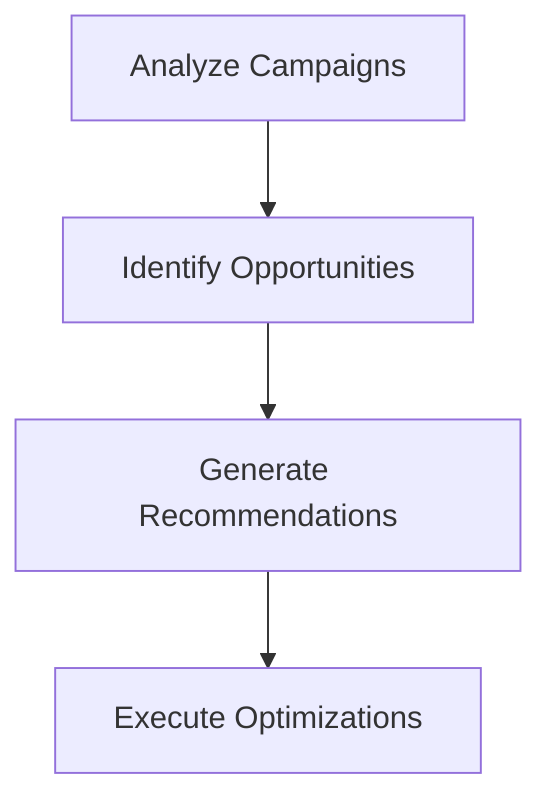

# PeppaSync LangChain - Business Intelligence Platform

A modern Business Intelligence platform powered by LangGraph and LangChain, replacing AWS Bedrock with OpenAI for AI-driven analytics and automated business insights.

## 🌟 Features

### Core Capabilities
- **Conversational BI**: Natural language queries with context-aware responses
- **Automated Agents**: LangGraph-powered inventory and marketing optimization agents  
- **Analytics Engine**: Comprehensive business analytics with AI insights
- **Multi-Modal Analysis**: Sales, inventory, customer, marketing, and revenue analytics
- **Real-time Insights**: AI-generated recommendations and forecasting

### Agent System
- **Inventory Agent**: Automated stock monitoring, reorder alerts, and procurement recommendations
- **Marketing Agent**: Campaign performance optimization, budget allocation, and ROAS improvement
- **Analytics Engine**: Multi-dimensional business analysis with Nigerian market specialization

## 🚀 Quick Start

### Prerequisites
- Python 3.9+
- OpenAI API Key
- PostgreSQL (optional, uses mock data by default)

### Installation

1. **Clone and Setup**
   ```bash
   git clone <repository-url>
   cd peppasync-langchain
   ./start.sh  # Automated setup script
   ```

2. **Manual Setup** (Alternative)
   ```bash
   # Create virtual environment
   python3 -m venv venv
   source venv/bin/activate  # On Windows: venv\Scripts\activate
   
   # Install dependencies
   pip install -r requirements.txt
   
   # Setup environment
   cp .env.example .env
   # Edit .env with your API keys
   ```

3. **Configuration**
   Edit `.env` file:
   ```env
   OPENAI_API_KEY=your_openai_api_key_here
   DATABASE_HOST=localhost
   DATABASE_NAME=peppagenbi
   DATABASE_USER=postgres
   DATABASE_PASSWORD=your_password
   ```

4. **Run Application**
   ```bash
   python app.py
   ```

   Access at: http://localhost:8000
   
   API Documentation: http://localhost:8000/docs

5. **Run Tests**
   ```bash
   # Run all tests
   python run_tests.py
   
   # Or run specific test suites
   python tests/tests_api_endpoints.py
   python tests/tests_advanced_ai.py
   ```

## 📊 API Endpoints

### Chat & Conversation
- `POST /chat` - Enhanced conversational BI with context
- `DELETE /session/{session_id}` - Clear conversation session

### Analytics
- `POST /analytics/{analysis_type}` - Run specific analysis
  - `sales_performance` - Sales trends and growth analysis
  - `inventory_analysis` - Stock levels and reorder recommendations  
  - `customer_segmentation` - Customer behavior and segments
  - `marketing_performance` - Campaign ROAS and optimization
  - `revenue_trends` - Revenue forecasting and patterns
  - `product_performance` - Product and category analysis

### Automated Agents
- `POST /agents/inventory/run` - Execute inventory monitoring agent
- `POST /agents/marketing/run` - Execute marketing optimization agent
- `GET /agents/status` - Get status of all agents

### Legacy Compatibility
- `POST /retrieve_and_visualize` - Generate visualization code
- `POST /retrieve_and_generate` - Generate business insights

## 🤖 LangGraph Agent Architecture

### Inventory Agent Workflow


**Capabilities:**
- Real-time stock level monitoring
- Automated reorder point alerts
- Supplier coordination recommendations
- Cash flow impact analysis
- Critical item flagging

### Marketing Agent Workflow


**Capabilities:**
- Multi-platform campaign analysis (Facebook, Instagram, Google, TikTok)
- ROAS optimization and budget reallocation
- Creative and targeting recommendations
- Nigerian market specialization
- Automated performance reporting

## 🔧 Technical Architecture

### Project Structure
```
peppasync-langchain/
├── app.py                 # Main FastAPI application
├── lib/                   # Core business logic
│   ├── peppagenbi.py     # RAG engine with FAISS
│   ├── conversation_manager.py # LangGraph workflows
│   ├── analytics_engine.py     # Business analytics
│   ├── prompt_engine.py        # Advanced prompt analysis
│   ├── agents/                 # Automated business agents
│   │   ├── inventory_agent.py  # Stock monitoring
│   │   └── marketing_agent.py  # Campaign optimization
│   └── utils/            # Helper functions
├── tests/                # Test suites
│   ├── tests_api_endpoints.py   # API testing
│   ├── tests_advanced_ai.py     # AI capabilities testing
│   └── PROMPT_SAMPLES.md        # 100+ business scenarios
├── Dockerfile           # Container deployment
├── docker-compose.yml   # Full stack deployment
├── requirements.txt     # Python dependencies
└── start.sh            # Quick setup script
```

### Technology Stack
- **Framework**: FastAPI for high-performance APIs
- **AI/ML**: LangChain + LangGraph for agent workflows
- **LLM**: OpenAI GPT-4o-mini for cost-effective AI
- **Vector Store**: FAISS for local knowledge retrieval
- **Database**: PostgreSQL (with mock data fallback)
- **Deployment**: Docker-ready, cloud-agnostic

### Key Components

1. **GenBISQL**: Core BI engine with RAG capabilities
2. **ConversationManager**: LangGraph-powered context management
3. **SimpleAnalyticsEngine**: Multi-dimensional business analytics
4. **Agent System**: Automated business process optimization

### LangGraph Implementation
- **State Management**: Pydantic models for type safety
- **Node Architecture**: Modular, reusable workflow components
- **Error Handling**: Robust error recovery and logging
- **Async Processing**: Non-blocking operations for scalability

## 🌍 Nigerian Market Focus

The platform is specifically optimized for Nigerian businesses:

- **Currency**: All monetary values in Nigerian Naira (₦)
- **Market Context**: Local consumer behavior and purchasing patterns
- **Platform Preferences**: Nigerian social media and digital adoption
- **Economic Factors**: Inflation, exchange rates, and market dynamics
- **Supply Chain**: Local supplier networks and logistics considerations

## 📈 Sample Analytics

### Sales Performance Analysis
```json
{
  "analysis_type": "sales_performance",
  "metrics": {
    "total_revenue": 18500000,
    "growth_rate_percent": 64.0,
    "trend": "increasing",
    "currency": "NGN"
  },
  "ai_insights": "Strong growth driven by electronics category..."
}
```

### Inventory Alerts
```json
{
  "analysis_type": "inventory_analysis",
  "low_stock_alerts": [
    {
      "product_name": "iPhone 15 Pro",
      "current_stock": 5,
      "reorder_level": 20,
      "priority": "CRITICAL"
    }
  ],
  "ai_insights": "Immediate restocking needed for 3 critical items..."
}
```

## 🔄 Migration from AWS Bedrock

### Key Changes
- **LLM Provider**: AWS Bedrock → OpenAI GPT-4o-mini
- **Vector Store**: AWS Knowledge Base → Local FAISS
- **Agent Framework**: Custom → LangGraph
- **Database**: AWS Redshift → PostgreSQL (configurable)
- **Deployment**: AWS Lambda → Standalone FastAPI

### Benefits
- **Cost Reduction**: ~70% reduction in AI inference costs
- **Vendor Independence**: No AWS lock-in
- **Enhanced Capabilities**: More sophisticated agent workflows
- **Local Development**: Full functionality without cloud dependencies
- **Improved Performance**: Reduced latency and cold starts

## 🚀 Deployment Options

### Local Development
```bash
python app.py  # Direct execution
uvicorn app:app --reload  # With auto-reload
```

### Docker Deployment
```bash
# Build image
docker build -t peppasync-langchain .

# Run container
docker run -p 8000:8000 --env-file .env peppasync-langchain
```

### Cloud Deployment
Compatible with:
- **Heroku**: `Procfile` included
- **Google Cloud Run**: Container-ready
- **AWS ECS/Fargate**: Docker deployment
- **Azure Container Instances**: Standard FastAPI deployment

## 📚 Advanced Features

### Custom Analysis Types
Extend the analytics engine:
```python
# Add new analysis in analytics_engine.py
async def _analyze_custom_metric(self, filters: Dict) -> Dict[str, Any]:
    # Your custom analysis logic
    pass
```

### Agent Customization
Create custom agents:
```python
from langgraph.graph import StateGraph
from pydantic import BaseModel

class CustomState(BaseModel):
    # Define your state

class CustomAgent:
    def _build_custom_graph(self) -> StateGraph:
        # Build your workflow
        pass
```

### Vector Store Integration
Add custom knowledge:
```python
# Add documents to vector store
documents = [Document(page_content="Your business knowledge")]
vector_store = FAISS.from_documents(documents, embeddings)
```

## 🤝 Contributing

1. Fork the repository
2. Create feature branch (`git checkout -b feature/amazing-feature`)
3. Commit changes (`git commit -m 'Add amazing feature'`)
4. Push to branch (`git push origin feature/amazing-feature`)
5. Open Pull Request

## 📄 License

MIT License - see LICENSE file for details

## 🆘 Support

- **Documentation**: Check `/docs` endpoint when running
- **Issues**: GitHub Issues for bug reports
- **Discussions**: GitHub Discussions for questions

## 🔮 Roadmap

- [ ] Real-time dashboard UI
- [ ] Advanced forecasting models
- [ ] Multi-tenant architecture
- [ ] Integration marketplace
- [ ] Mobile API optimization
- [ ] Advanced security features

---

**Built with ❤️ for Nigerian businesses using modern AI technologies**